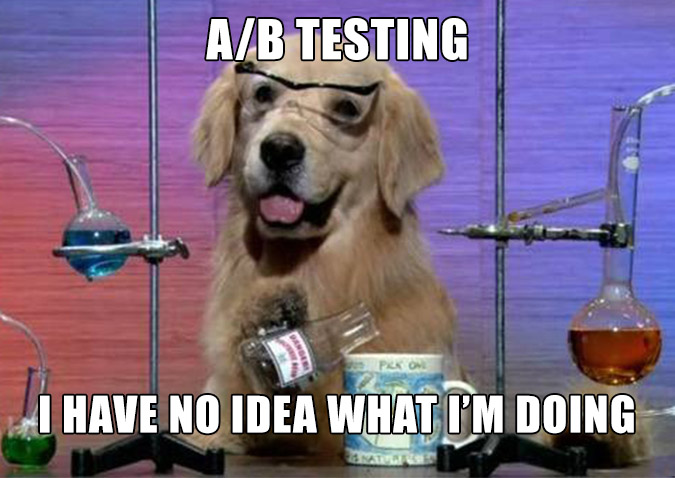

# 📊 Репозиторий по A/B тестам

Этот репозиторий содержит материалы и домашние задания по курсу **A/B тестирования**. Курс охватывает ключевые аспекты дизайна, анализа и интерпретации A/B тестов, а также различные методы повышения мощности и корректности  тестов.

---
## 📚 Краткое описание домашних заданий

### 🏠 Домашнее задание 1

#### Дизайн теста с использованием бутстрепа
- Анализ корректности и мощности теста на данных за две недели.
- Расчёт MDE (минимального detectable effect) для заданных уровней ошибок.
- Добавление эффекта (1%, 3%, 5%) и сравнение мощности.

#### Сравнение различных методов анализа
- Бутстреп, t-тест, Манна-Уитни с логарифмированной и обычной метрикой длительности просмотров.
- Выбор оптимального метода для анализа A/B теста.

#### Анализ результатов A/B теста
- Обработка данных (зануление значений для пользователей с низкой активностью).
- Разделение на группы и добавление эффекта для 10% самых активных пользователей.

---

### 🏠 Домашнее задание 2

#### Ранговая трансформация и сравнение с критерием Манна-Уитни
- Применение ранговой трансформации к метрике `cart_added_cnt` и сравнение с результатами Манна-Уитни.

#### CUPED-трансформация
- Применение CUPED к обычной, логарифмированной и ранговой метрике.
- Сравнение мощности t-критерия до и после применения CUPED.

#### Бакетирование данных
- Разбиение данных на бакеты для логнормального распределения и метрики `cart_added_cnt`.
- Сравнение результатов t-критерия с бакетированием и без.

#### Постстратификация
- Применение постстратификации для метрики `cart_added_cnt` на основе пола и возраста.
- Сравнение дисперсии и средних значений до и после постстратификации.

---

## 🏆 Результаты

- **Курс сдан на 100/100** (не иначе как магия чисел 🔮).  
- **Изученные методы**: бутстреп, CUPED, ранговые преобразования, бакетирование, постстратификация.  
- **Самый полезный навык**: **CUPED** — удивительное средство для снижения дисперсии (теперь сплю спокойнее).  
- **Самый сложный момент**: сидеть и ждать, когда твой аб-тест закончит выполняться...
---

  

